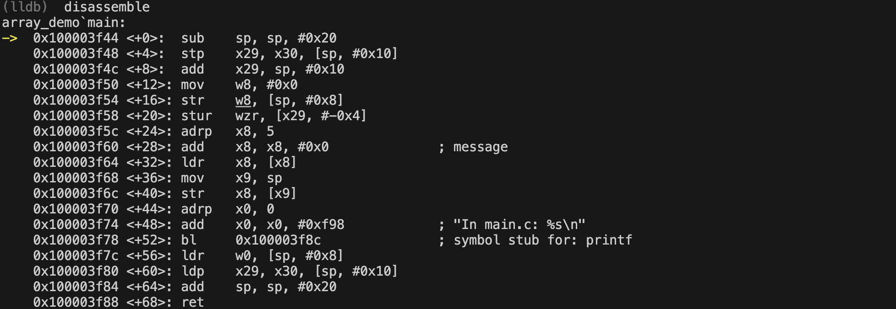
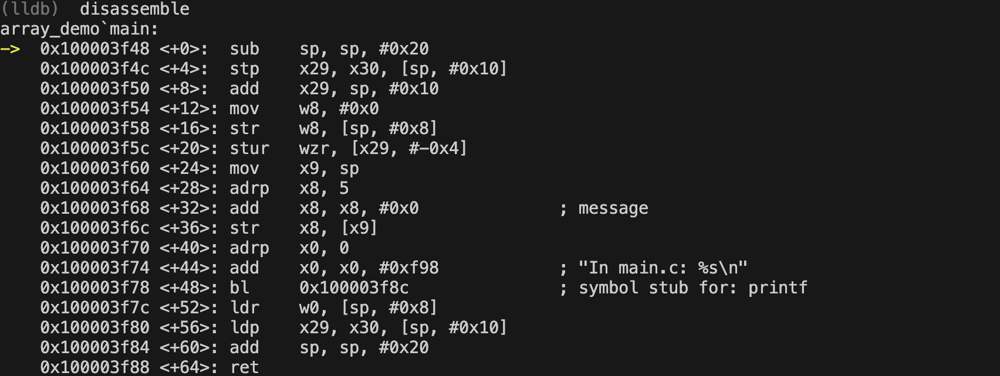

# Array is Not a Pointer Demo

This small C project demonstrates a common misconception in C programming: treating arrays and pointers as identical types in external declarations.

## Build
```bash
make
```

## Run
```bash
./array_demo
```

## Why this dummy C project?

This project illustrates a subtle but important concept in C programming: **arrays and pointers are different types**. 

In `foo.c`, we have:
```c
char array[] = "Hello World";  // Defines an array
```

In `main.c`, we incorrectly declare it as:
```c
extern char *array;  // WRONG: array declared as pointer
```

The correct declaration should be:
```c
extern char array[];  // RIGHT: array declared as array
```

### Key Learning Points:
1. Arrays are constant addresses that cannot be modified
2. Pointers are variables that store addresses
3. The linker only matches symbol names, not types


### Common Misconception
Many C programmers think arrays and pointers are interchangeable because arrays often decay into pointers. However, when using `extern` declarations, you must use the correct type.

This example causes a segmentation fault because the linker places the pointer variable `array` at the same address where the array data begins, rather than creating a pointer variable that points to the array.

### How to Fix
Change the declaration in `main.c` from `extern char *array` to `extern char array[]` to fix the segmentation fault.


### asm
 

```
str x8, [x9]       ; Tries to use message directly as a pointer
```


```
ldr x8, [x8]       ; Properly loads the address of the array
```

This single instruction difference explains why the pointer version crashes - it tries to use the array's data as a pointer address rather than loading the actual array address.